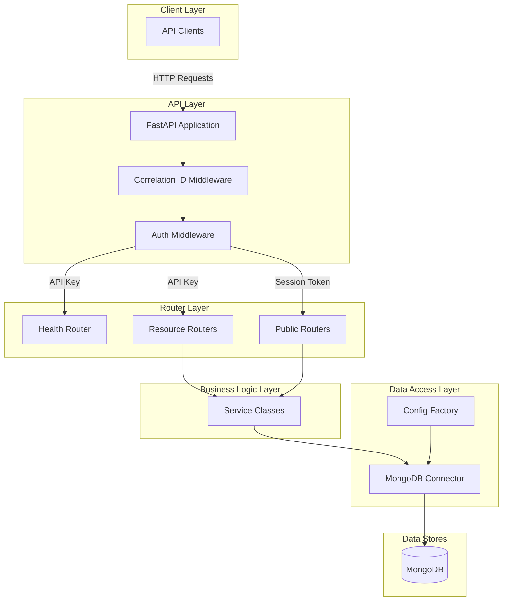

# System Architecture

The application follows a layered architecture pattern with clear separation between routing, business logic, and data access.

## Component Overview

### Application Layer (`main_app.py`)
- FastAPI application initialization
- Lifespan management (startup/shutdown)
- Middleware registration
- Router inclusion

### Middleware Layer (`api/middleware/`)
- **CorrelationIDMiddleware**: Generates/accepts correlation IDs for request tracing
- **Auth Middleware**: Validates `api_key` header on protected routes, session token on `/public/` routes

### Router Layer (`api/routers/`)
- **Health Router**: Health check endpoints (`/health`, `/health/live`, `/health/ready`)
- **Resource Routers**: Domain-specific CRUD and action endpoints (API key auth)
- **Public Routers**: Public-facing endpoints under `/public/` (session token auth)

### Business Logic Layer
- Service classes encapsulating domain logic
- Decoupled from HTTP layer (receives typed inputs, returns typed outputs)

### Data Access Layer (`utilities/`)
- **MongoDB Connector**: Manages connections with pooling and retry logic
- **Config Factory**: Centralized configuration management
